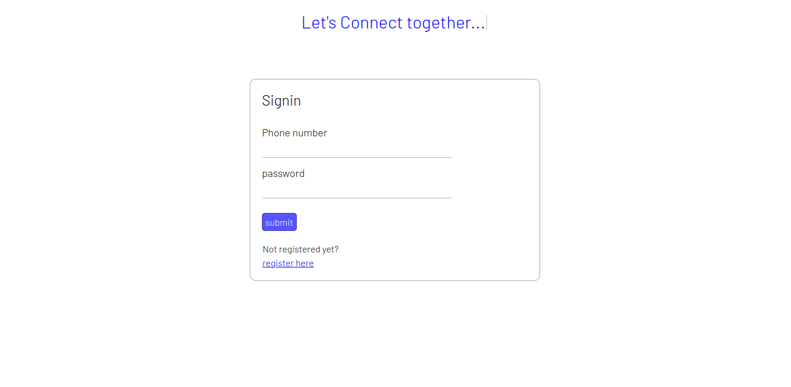
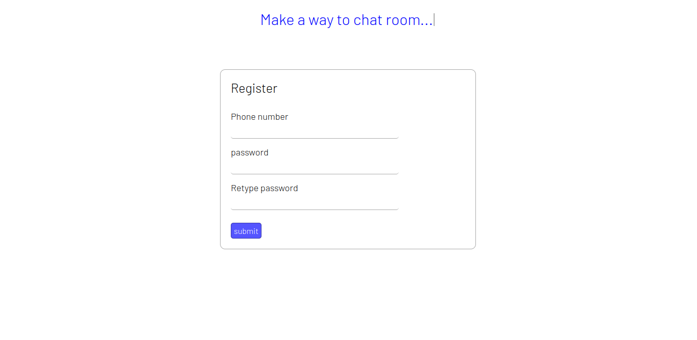
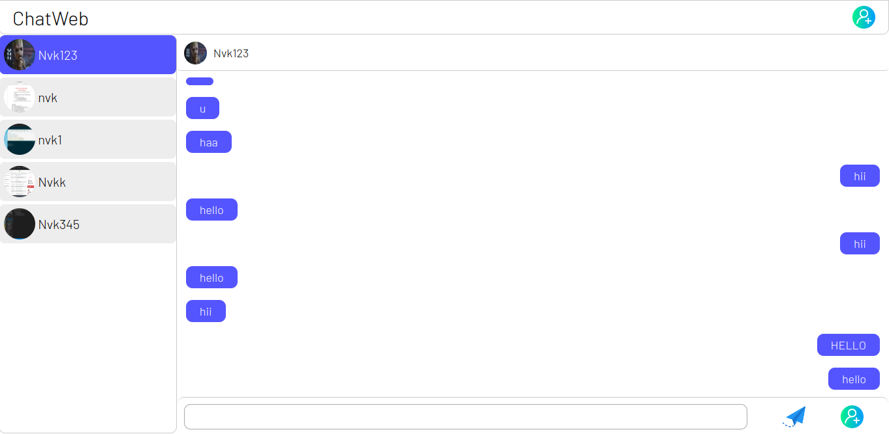
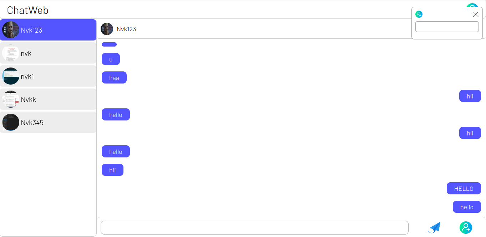
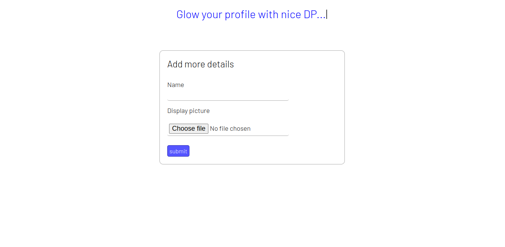

<h1>ShowTime-An OTT platform</h1>
<h2>Tech Stack Used:</h2>
<h3>Frontend:</h3>
<ul>
	<li>HTML</li>
	<li>css</li>
	<li>Js,DOM</li>
</ul>
<h3>Backend:</h3>
<ul>
	<li>Nodejs</li>
	<li>Expressjs</li>
	<li>Socket.io for chat functionality</li>
	<li>Mongodb for Database</li>
</ul>
<i>To implement web sockets and to use MongoDB I developed this project.Using Socket.io module I achieved web sockets implementation.</i>
<h2>Login Page</h2>

<h2>Register Page</h2>

<h2>UserChat</h2>

<h2>Add Contact functionality</h2>

<h2>ProfileUpdate Page</h2>

